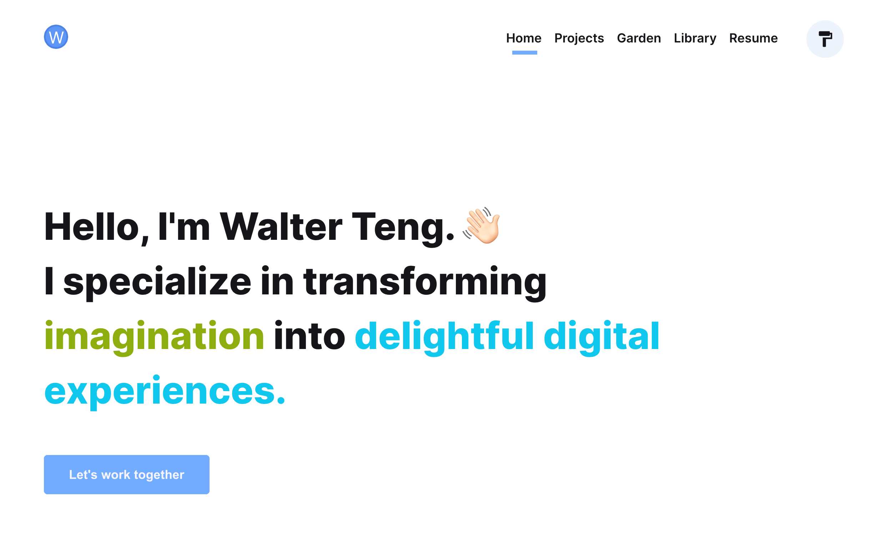

<div align="center">
  
</div>

<h1 align="center">
  walterteng.com - v1
</h1>

<p align="center">
  <a href="https://app.netlify.com/sites/walterteng/deploys" target="_blank">
    
  </a>
</p>

<p align="center">
  The first iteration of <a href="https://walterteng.com" target="_blank">walterteng.com</a> built with <a href="https://www.gatsbyjs.org/" target="_blank">Gatsby</a>  and hosted with <a href="https://www.netlify.com/" target="_blank">Netlify</a>
</p>

<div align="center">
  
</div>

## About the Site

This site serves as a common ground / digital garden to share my projects and notes.

### Inspiration

I have came across many beautiful personal websites while developing my own. Some of the design ideas are influenced by these awesome developers and designers, do check out their work too: @margueriteroth, @bchiang7, @maxboeck, @MaggieAppleton, @slarsendisney, @joshwcomeau, @mxstbr

### The Stack

- React
- Typescript
- Gatsby
- MDX
- [Emotion](https://emotion.sh/docs/styled)
- [GraphQL Code Generator](https://www.graphql-code-generator.com/)
- [eslint-config-wesbos](https://github.com/wesbos/eslint-config-wesbos)
- Docker
- Husky

### Using Docker

This Gatsby site supports Docker for local development.

To run the Docker container on your local machine:

```bash
docker compose up
```

For more info on the Docker config and how to set up similar configurations for your Gatsby site: <a href="https://walterteng.com/gatsby-docker" target="_blank">My Docker Setup for Gatsby</a>

## Changelog

The changelog is maintained <a href="https://walterteng.com/how-i-built-my-website-v1" target="_blank">here</a>

## Architecture Decision Records (ADR)

The decisions for this site are recorded within [this repository folder](/docs/adr/), using [phodal/adr](https://github.com/phodal/adr).

For more info on [ADR](https://adr.github.io/).

### ADR Commands

```
// to add new ADR
adr new <decision-name>

// list
adr list

// generate toc
adr generate toc

// export
adr export <csv/html/json>
```
