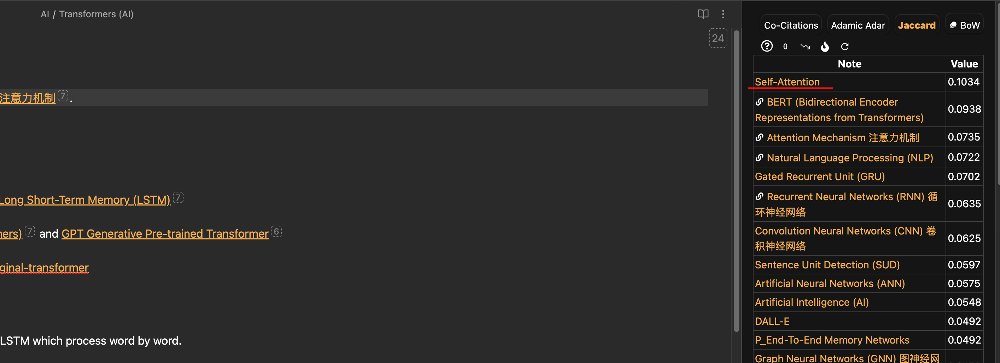

<BasicImage
  src="https://res.cloudinary.com/wtkw/image/upload/v1682865633/waltertengcom/garden/obsidian-plugins/cover_wrp2je.png"
  alt="cover"
/>

```toc

```

## What is Obsidian?

[Obsidian](https://obsidian.md/) is a versatile note-taking app that has quickly become a favorite among knowledge workers, writers, and students. In its vanilla form, it is sufficient for most essential note-taking tasks, and I believe one should experience it first before starting to explore the vast array of plugins available. Blindly installing plugins on a just-in-case basis will only add unnecessary bloat to your own note-taking experience.

With this idea in mind, this article will progressively introduce plugins to fulfill a specific need based on my experience. An extra note is that, I am using Obsidian purely as a knowledge vault without any other aspects such as daily journaling or life management etc.

The plugins are introduced based on tasks, namely [Essentials](#essential-plugins), [Notes Management](#notes-management), [Notes Linking](#notes-linking), [Notes Visualization](#notes-visualization), [Notes Generation](#notes-generation), [Slides Generation](#slides-generation), [Research](#research) and [Theme](#theme).

## Essential Plugins

### Obsidian Git

**Plugin Link:** [denolehov/obsidian-git](https://github.com/denolehov/obsidian-git)

Obsidian Git is a free alternative to the native [Obsidian Sync](https://obsidian.md/sync). It allows you to back your Obsidian.md vault to a remote Git repository (e.g. private repo on GitHub) at configurable intervals. Some basic [Git](https://www.w3schools.com/git/) knowledge will be helpful.

I kept most settings as default since my setup is very simple. I set the `Vault backup interval (minutes)` at 10 minutes. Read and write is from a single laptop and read-only on my mobile or iPad. This setup reduces the possibility of any merge conflicts to a minimum.

> **Additional Tip:** You can set different `.obsidian` config folders on different devices by manually changing the setting at `About > Override config folder`
>
> **Use Case:** If you want _different settings or look and feel on desktop and mobile_, you can configure 2 config folders, `.obsidian.desktop` and `.obsidian.mobile` for example. More on this: [Switch Between Multiple Obsidian Configurations With Ease · Preslav Rachev](https://preslav.me/2022/10/17/switch-between-multiple-obsidian-configurations-with-ease/)

## Notes Management

This section introduces plugins for general management of notes in Obsidian.

### Janitor

**Plugin Link:** [Canna71/obsidian-janitor](https://github.com/Canna71/obsidian-janitor)

Janitor helps to keep your vault by scanning your vault for

- Orphan files: media or attachments that are not referenced in any notes.
- Empty files: notes that are empty.
- Big files: files with size that are above an user-defined threshold.
- Expired files: files with `expires` front matter

For example, I will periodically browse through empty notes using Janitor and update them accordingly.

<BasicImage
  src="https://res.cloudinary.com/wtkw/image/upload/v1682867854/waltertengcom/garden/obsidian-plugins/janitor-results_pdrwvq.png"
  alt="Janitor"
/>

### Obsidian Dataview

**Plugin Link:** [blacksmithgu/obsidian-dataview](https://github.com/blacksmithgu/obsidian-dataview)

Obsidian Dataview turns your Obsidian Vault to a database so that you can generate a table view similar to Notion. (and much more.)

There are many use cases for this. One general usecase of mine is to look for strongly connected notes. Below is a simple SQL-like syntax to get the mentioned table view.

```dataview
TABLE file.name as name, length(file.inlinks) + length(file.outlinks) as totalLinks
WHERE length(file.inlinks) + length(file.outlinks) > 10
SORT length(file.inlinks) + length(file.outlinks) desc
```

<BasicImage
  src="https://res.cloudinary.com/wtkw/image/upload/v1682867855/waltertengcom/garden/obsidian-plugins/dataview-results_llijp4.png"
  alt="Data View"
/>

### Recent files

**Plugin Link:** [tgrosinger/recent-files-obsidian](https://github.com/tgrosinger/recent-files-obsidian)

Recent Files for Obsidian displays a list of the most recently open files in the sidebar that is similar to VSCode.

<BasicImage
  src="https://res.cloudinary.com/wtkw/image/upload/v1682867855/waltertengcom/garden/obsidian-plugins/recent-files-results_gwvtnn.png"
  alt="Recent Files"
/>

### Vault Statistics

**Plugin Link:** [bkyle/obsidian-vault-statistics-plugin](https://github.com/bkyle/obsidian-vault-statistics-plugin)

Vault Statistics is a simple plugin adds vault statistics including the number of notes, files, attachments, and links on the status bar on the bottom right. This is also similar to a typical VSCode look and feel.

## Notes Linking

This section showcases a list of plugins that boosts Obsidian's existing graphing capabilities with additional superpowers like link prediction.

### Graph Analysis

**Plugin Link:** [SkepticMystic/graph-analysis](https://github.com/SkepticMystic/graph-analysis)

Graph Analysis adds the power of suggesting related notes based on algorithm such as Similarity and Link Prediction.

For example, I have a note about Transformers in the field of Artifical Intelligence. Graph Analysis is able to suggest a possible relation to Self-Attention which is not linked yet _(linked notes have a link emoji beside it)_. By glancing at the sidebar, I can decide whether to update my existing note to link to the top few recommendations from this plugin.

#todo



There are many more algorithms available and you can the explaination from the creator himself below.

https://www.youtube.com/watch?v=Id4ynVqP3Uo

### Strange New Worlds (SNW)

**Plugin Link:** [TfTHacker/obsidian42-strange-new-worlds](https://github.com/TfTHacker/obsidian42-strange-new-worlds)

Strange New Worlds of networked thought helps users visualize the connections between various parts of their Obsidian vault, including links, block references, and embeds. Rather than searching through backlinks and other tools, this plugin aims to surface those connections in a non-intrusive manner, making it easier to discover new ideas and connections within the vault.

<BasicImage
  src="https://res.cloudinary.com/wtkw/image/upload/v1682868222/waltertengcom/garden/obsidian-plugins/SNW_yyh48f.gif"
  alt="SNW"
/>

## Notes Visualization

This section covers plugins that gives Obsidian additional visualization capabilities.

### Mindmap NextGen

**Link:** [verocloud/obsidian-mindmap-nextgen](https://github.com/verocloud/obsidian-mindmap-nextgen)

Mindmap NextGen uses [Markmap](https://markmap.js.org/) to help you to visualize your notes as mindmaps.

You can either embed a mindmap using a codeblock or visualize your current note as a mindmap as such:

<BasicImage
  src="https://res.cloudinary.com/wtkw/image/upload/v1682867855/waltertengcom/garden/obsidian-plugins/mindmap-results_cdbb5k.png"
  alt="cover"
/>

### Timeline

**Plugin Link:** [George-debug/obsidian-timeline](https://github.com/George-debug/obsidian-timeline)

The Timeline plugin is a powerful tool that generates a visual timeline based on your notes. It's particularly useful when you need to visualize the evolution of a concept over time.

<BasicImage
  src="https://res.cloudinary.com/wtkw/image/upload/v1682867856/waltertengcom/garden/obsidian-plugins/timeline-demo_voqpdn.gif"
  alt="timeline"
/>

## Notes Generation

### Text Generator

The Text Generator plugin is an excellent tool that integrates with OpenAI API, allowing for a "Notion AI"-like experience within Obsidian. With this plugin, you can add prompt templates to improve your productivity and work with ChatGPT without leaving Obsidian.

To see the magic of this plugin in action, check out the video below.

https://www.youtube.com/watch?v=OergqWCdFKc

## Slides Generation

### Slides and Advanced Slides

**Plugin Link:** [MSzturc/obsidian-advanced-slides](https://github.com/MSzturc/obsidian-advanced-slides)

Did you know you can create slides from your notes with a builtin plugin, Slides?

Slides is a great way to create slides from your notes. This feature is particularly useful for informal presentations that don't require extensive formatting or fancy visuals.

Like most Obsidian's core features, the community have came up with an impressive improvement of Slides to include themes, annotations and export features with a plugin called Advanced Slides.

<BasicImage
  src="https://res.cloudinary.com/wtkw/image/upload/v1682867855/waltertengcom/garden/obsidian-plugins/advanced-slides-demo_qlihud.gif"
  alt="Advanced Slides"
/>

> Generating slides from markdown is not unique to Obsidian. It is available in other markdown-related tools such as [Quarto](https://quarto.org/docs/presentations/revealjs/). In other words, it is a possibility to use your markdown slides across various applications with minor edits.
>
> For more info: [Best Markdown Presentation Tools](https://www.youtube.com/watch?v=owx5KoiqFBs)

## Research

### Citation

**Plugin Link:** [hans/obsidian-citation-plugin](https://github.com/hans/obsidian-citation-plugin)

To manage my research workflow, I mainly use the Citation plugin to automatically create a literature note in Obsidian with relevant metadata populated from [Zotero](https://www.zotero.org/).

I have gone into detail on my research reading workflow in a separate note called [Paperwise](/paperwise).

## Theme

### AnuPpuccin with Style Settings

**Plugin Links:**

- [AnubisNekhet/AnuPpuccin](https://github.com/AnubisNekhet/AnuPpuccin)

- [mgmeyers/obsidian-style-settings](https://github.com/mgmeyers/obsidian-style-settings)

I'm currently using the AnuPpuccin theme to customize the appearance of my Obsidian vault. To further fine-tune the theme, I use the Style Settings plugin to access additional CSS settings.

Essentially, I am just using the base setup from the video below.

https://www.youtube.com/watch?v=7-SOwxpZQNI

AnuPpuccin offers a plethora of aesthetic options, including custom checkboxes and speech bubbles. However, I find that the basic visuals, such as colored headers and text formatting, are the most useful for my workflow.

#todo

<BasicImage
  src="https://res.cloudinary.com/wtkw/image/upload/v1682867854/waltertengcom/garden/obsidian-plugins/anuppucin-results_ial8eo.png"
  alt="cover"
/>

## Wrapping Up

In this article, I have shared a list of plugins that have proven useful in my current Obsidian workflow. As the Obsidian community is constantly evolving, there are sure to be many more useful plugins available in the future. I plan to keep this list updated as I discover new plugins and would welcome suggestions from others in the community. Feel free to reach out via Twitter if you have any cool plugins to recommend.
