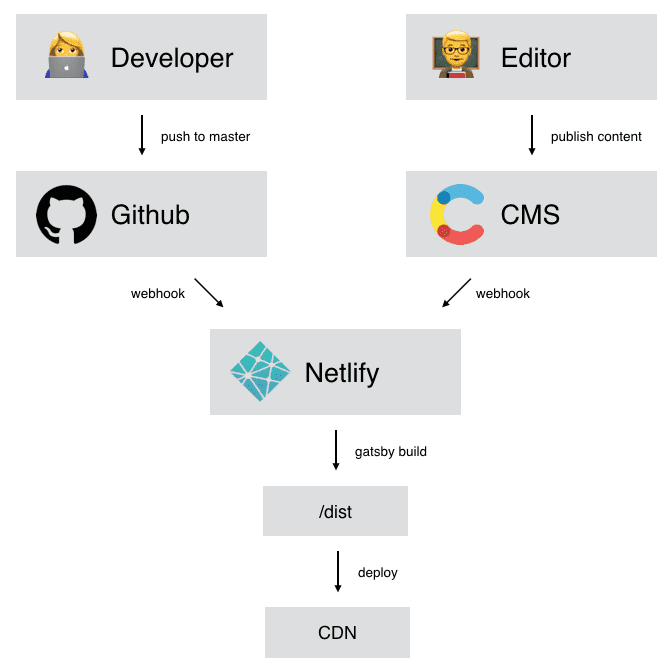

# 1. gatsby-source-selection

Date: 2021-07-20

## Status

2021-07-20 Accepted

## Context

Codebase is bootstrapped with [Prist](https://github.com/margueriteroth/gatsby-prismic-starter-prist); a Gatsby theme that uses Prismic CMS out-of-the-box

It was designed primarily to separate the responsibilities of developer and content writer.

**Should code and content be kept separate or together in a single code base?**

## Decision

Based on personal preference as a developer, it is much easier to maintain a single codebase for both code and content. There is more control of the content, and reduce the decision fatigue to choose a particular CMS.

### MD vs MDX

Both Markdown (MD) and MDX allows user to store content as code. Since MDX is a superset of MD, and it allows us to write JSX and render React components inside MD; it is a natural choice.

## Consequences

- Both code and content in a single codebase
- No nice GUI for writing content
- Easier to migrate to v2 with new architecture in the future. Less concern of CMS integration.
