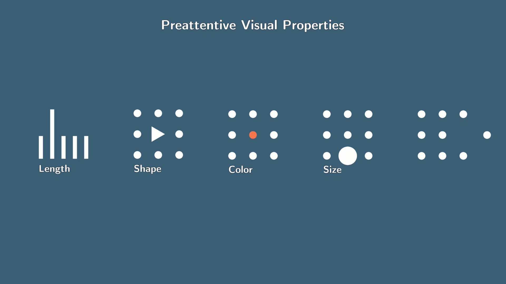
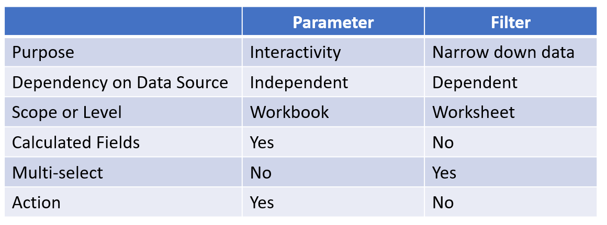

## Resources

1. [The Complete Tableau Bootcamp for Data Visualization | Udemy](https://www.udemy.com/course/complete-tableau-bootcamp-dashboards/)
2. [Tableau Official Documentation](https://help.tableau.com/current/pro/desktop/en-us/gettingstarted_overview.htm)
3. [Data Visualization with Tableau - Introduction to Tableau and Data Visualization](https://www.learnthepart.com/course/0a85e2c6-4e86-459e-b2bd-f313fcb5c5bd/488addb1-9fde-4661-a87c-337b430a1be7)
4. [Profile - walter | Tableau Public](https://public.tableau.com/app/profile/walter5005)

## Tableau Desktop vs Tableau Public

[Tableau Desktop vs Tableau Public vs Tableau Reader | Edureka](https://www.edureka.co/blog/tableau-desktop-vs-tableau-public-vs-tableau-reader/)

One of the most obvious difference between Tableau Desktop and Public is the amount of data sources supported.

In general, Tableau Public is sufficient for personal learning and create visualizations from CSV, Text and Excel documents. The other downside is that all workbooks have to be made public available on [Tableau Public](https://public.tableau.com/s/).

If you need to connect to a database and keep your visualization private, you will have to upgrade to the paid options.

## Introduction

### Data Types

There are two data types in Tableau: Categorical Data and Numerical Data.

- Categorical data are used to group data. They are known as **dimensions** in Tableau. Examples are gender, eye color, continents.

  - They can be **nominal** ie. the order of data don't matter eg. gender, eye color
  - or **ordinal** in which the order matter eg. rating, education level
  - categorical data can be split into **discrete** category
  - categorical data is not good for quantitive data

- Numerical data refers to data that you can **continuously** measure eg. temperature, height

> "Dimensions (blue pills) contain qualitative values (such as names, dates, or geographical data).
>
> Measures (green pills) contain numeric, quantitative values that you can measure."

### Granularity

In Tableau, we use dimensions to specify the granularity of a measure's calculation.

### Preattentive Visual Properties

A pre-attentive visual property is one that sticks out from the remaining environment.

These includes:

- length (eg. bar graph)
- shape
- color
- size
- position

#### Color Palette

1. A **categorical color palette** contains several distinct colors that can be assigned to discrete dimension members.
2. Another type of palette is the **sequential color palette**. Typically, this type of palette shows a single color, varying in intensity. This type of color palette is used for continuous fields, typically for measures.
3. The third type of color palette is a **diverging color palette**. A diverging palette shows two ranges of values using color intensity to show the magnitude of the number and the actual color to show which range the number is from. Diverging palettes are most commonly used to show the difference between positive and negative numbers.

### Calculated Fields

Sometimes your data source does not contain a field (or column) that you need for your analysis. For example, your data source might contain fields with values for Sales and Profit, but not for Profit Ratio. If this is the case, you can create a calculated field for Profit Ratio using data from the Sales and Profit fields.

> Shortcut to create calculated field: ALT+A the C

### Parameters vs Filters

[The Data School - Parameters vs Filters in Tableau](https://www.thedataschool.co.uk/kristine-wiesner/tableau-parameters)

Tableau defines parameters as workbook variables like a number, date, or calculated field that allows users to _replace a constant value_ in a calculation, filter, or reference line. While the primary role of filter is to _narrow down_ data, which allows both basic and complex filtering base on specific Order of Operation.

**A parameter is independent of the data source while filters are not.** We can see this when we add quick filters on, for example SUM(Sales), show filter and see how filters display exact number of boundaries, derived from data source. With parameters, user can set his own values and boundaries.

### Context Filters

By default, all filters that you set in Tableau are computed independently.

You may create a context filter to:

- Force a filter to be carried out first.
- Create a dependent numerical or top N filter. You can set a context filter to include only the data of interest, and then set a numerical or a top N filter.

### Sets

Sets are used to isolate a dimension into two fragments. For example, you might want to isolate orders that have:

1. average discount > 9%
2. average discount < 9%

### Set Actions

Use set actions to let your audience interact directly with a viz or dashboard to control aspects of their analysis. When someone selects marks in the view, set actions can change the values in a set.

## Groups vs Sets

[When to Use Filters, Groups & Sets in Tableau - InterWorks](https://interworks.com/blog/kwagner/2014/06/30/when-use-filters-groups-sets-tableau/)

Sets help us to isolate segments of a dimension based on a computed condition allows us to see a dynamic representation of our data that may change over time

Groups, on other hand, simplifies large numbers of dimension members by combining them into higher-level categories.

## Join, Union

> A join allows you to relate similar data in different tables.
>
> A union returns the results of two different queries as a single recordset.

A join is used for displaying columns with the same or different names from different tables. The output displayed will have all the columns shown individually. That is, the columns will be aligned next to each other.

The UNION set operator is used for combining data from two tables which have columns with the same datatype. When a UNION is performed the data from both tables will be collected in a single column having the same datatype.

## Pivot

[Pivot Your Data - Tableau](https://help.tableau.com/current/prep/en-us/prep_pivot.htm)

Sometimes analyzing data from a spreadsheet or crosstab format can be difficult in Tableau. Tableau prefers data to be "tall" instead of "wide", which means that you often have to pivot your data from columns to rows so that Tableau can evaluate it properly.

## Maps

### Types of Maps

[Build Maps in Tableau - Tableau](https://help.tableau.com/current/pro/desktop/en-us/maps_build2.htm)

Some common maps visualization includes:

- filled map
- heat map (density map)
- flow (path) map
- origin-destination map

### Supported Map Files

- GeoJSON
- KML
- Esri
- MapInfo
- TopoJSON

### External Map Servers

- [Use Web Map Service (WMS) Servers - Tableau](https://help.tableau.com/current/pro/desktop/en-us/maps_mapsources_wms.htm)
- [Use Mapbox Maps - Tableau](https://help.tableau.com/current/pro/desktop/en-us/maps_mapsources_mapbox.htm)

## Advanced Calculations

[Types of Calculations in Tableau - Tableau](https://help.tableau.com/current/pro/desktop/en-us/calculations_calculatedfields_understand_types.htm)

There are three main types of calculations you can use to create calculated fields in Tableau:

1. basic expressions
2. table calculations
3. level of detail (LOD) expressions

### Basic Expressions

Basic expressions allow you to transform values or members at the data source level of detail (a row-level calculation) or at the visualization level of detail (an aggregate calculation).

#### Row Level Calculation

For example, you want to split an existing column `Full Name` into `First Name` and `Last Name`.

#### Aggregate Calculation

For example, you want to create a new column to aggregate number of books in each series.

### Table Calculations

Table calculations allow you to transform values at the **level of detail of the visualization only.**

### Level of Detail (LOD) Expressions

Level of Detail expressions allow you to compute values at the data source level and the visualization level. However, LOD expressions give you **even more control on the level of granularity** you want to compute.

They can be performed at

- a more granular level (INCLUDE),
- a less granular level (EXCLUDE),
- or an entirely independent level (FIXED).

[Level of Detail Expressions - Tableau](https://help.tableau.com/current/pro/desktop/en-us/calculations_calculatedfields_lod.htm#FIXED)

#### FIXED

FIXED level of detail expressions compute a value using the specified dimensions, without reference to the dimensions in the view.

#### INCLUDE

INCLUDE level of detail expressions compute values using the specified dimensions in addition to whatever dimensions are in the view.

#### EXCLUDE

EXCLUDE level of detail expressions declare dimensions to omit from the view level of detail.

EXCLUDE level of detail expressions are useful for ‘percent of total’ or ‘difference from overall average’ scenarios. They are comparable to such features as Totals and Reference Lines.

EXCLUDE level of detail expression cannot be used in row-level expressions (where there are no dimensions to omit), but can be used to modify either a view level calculation or anything in between (that is, you can use an EXCLUDE calculation to remove dimension from some other level of detail expression).

## Worksheet vs Dashboard vs Story

> Use a dashboard to compare and monitor a variety of data simultaneously.
>
> Use stories to make your case more compelling by showing how facts are connected, and how decisions relate to outcomes.

A worksheet is where you build views of your data by dragging and dropping fields onto shelves.

A dashboard is a combination of several views that you can arrange for presentation or to monitor.

A story is a sequence of views or dashboards that work together to convey information.

### Tips on refining dashboard

[Refine Your Dashboard - Tableau](https://help.tableau.com/current/pro/desktop/en-us/dashboards_refine.htm#Use_a_layout_container)

1. Review sizing and layout over portait and landscape
2. Create custom layout for each device viewport
3. Use layout containers to reposition and resize objects easily

## Color Vision Deficiency

About 1 in 20 people are colorblind in some way. We need to take note of the usage of colors in our data visualization process.

### Types of Color Blindness

[Types of Colour Blindness - Colour Blind Awareness](https://www.colourblindawareness.org/colour-blindness/types-of-colour-blindness/)

People with _protanopia_ are unable to perceive any ‘red’ light, those with _deuteranopia_ are unable to perceive ‘green’ light and those with _tritanopia_ are unable to perceive ‘blue’ light.

### Tips

1. Use a color blind friendly palette eg. Color Blind 10 Palette
   - [Workbook: TableauColors](https://public.tableau.com/views/TableauColors/ColorPaletteswithRGBValues?%3Aembed=y&%3AshowVizHome=no&%3Adisplay_count=y&%3Adisplay_static_image=y#3)
2. Use a simulator to see how your visualizations may look like.
   - [Coblis — Color Blindness Simulator – Colblindor](https://www.color-blindness.com/coblis-color-blindness-simulator/)

## Other Resources

1. Weekly challenge and community
   - [Makeover Monday | A weekly social data project](https://www.makeovermonday.co.uk/)
2. Public Datasets
   - [Kaggle: Your Machine Learning and Data Science Community](https://www.kaggle.com/)
   - [data.world | The Cloud-Native Data Catalog](https://data.world/)
   - [Open Data](https://www.freecodecamp.org/news/https-medium-freecodecamp-org-best-free-open-data-sources-anyone-can-use-a65b514b0f2d/)
3. Drawing Tools for Tableau
   - [Take Control of Your Tableau Workbooks - Power Tools for Tableau](https://powertoolsfortableau.com/)
     - [Color Tool for Tableau](https://colortool.powertoolsfortableau.com/)
     - [CBI Studio](https://cbistudio.interworks.com/)
